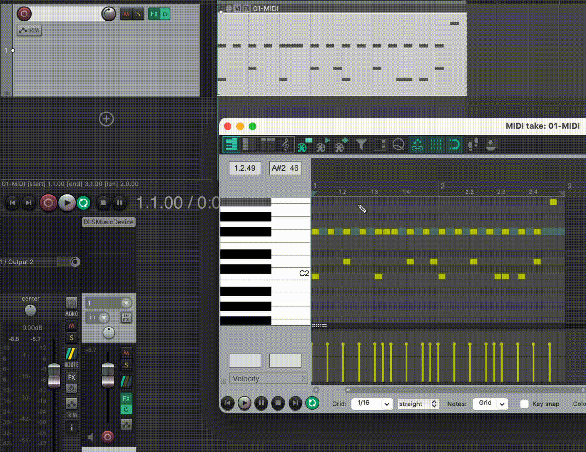

<div align="center">

# Dynamics Needed

**Give flat MIDI drums a human touch — automatically.**

Real drummers never hit every note at the same strength. *Dynamics Needed* looks at a
MIDI drum part and predicts a natural, human-feeling **velocity** (loudness) for every
note — the accents, ghost notes, and swells a machine-perfect take is missing.

[**▶ Try the live demo**](https://huggingface.co/spaces/yalishanda/dynamics-needed) &nbsp;·&nbsp;
[Install in Reaper](#install-in-reaper) &nbsp;·&nbsp;
[Models on Hugging Face](https://huggingface.co/yalishanda) &nbsp;·&nbsp;
[Web page](https://yalishanda42.github.io/dynamics-needed/)



</div>

---

Given a MIDI **drum** track, the models predict each note's
best-fitting velocity — restoring *dynamics* (loudness/expression), as opposed to the
timing/tempo "humanization" most tools already do. Trained on the
[Expanded Groove MIDI Dataset (E-GMD)](https://magenta.tensorflow.org/datasets/e-gmd).

There are three ways to use this project, depending on who you are:

- 🥁 **Musicians** — a one-click plugin for the Reaper DAW. [Jump to install ↓](#install-in-reaper)
- 🧑‍💻 **Developers** — run the code, the tests, and build the plugin engine yourself. [Jump ↓](#for-developers)
- 🔬 **Researchers** — the dataset, models, and training scripts. [Jump ↓](#for-researchers)

Prefer not to install anything? The
[**live demo**](https://huggingface.co/spaces/yalishanda/dynamics-needed) runs entirely
in your browser tab.

---

## Install in Reaper

The plugin runs inside [Reaper](https://www.reaper.fm/) and rewrites the velocities of
your selected drum notes, right in the MIDI editor. It works offline — nothing you play
leaves your computer.

**1. Install the two free extensions** (once):

- [ReaPack](https://reapack.com/) — Reaper's package manager.
- [ReaImGui](https://github.com/cfillion/reaimgui) — the UI toolkit the plugin uses.
  In Reaper: *Extensions → ReaPack → Browse packages…*, search **ReaImGui**, install it.

**2. Add the Dynamics Needed repository:**

*Extensions → ReaPack → Import repositories…*, and paste this URL:

```
https://yalishanda42.github.io/dynamics-needed/index.xml
```

**3. Install the plugin:** *Extensions → ReaPack → Browse packages…*, search
**Dynamics Needed**, and install it.

**4. Run it:** open a MIDI item with drums, then *Actions → Show action list…* and run
**Custom: dynamics_needed.py** (bind it to a key or toolbar button for quick access).

The **first time** you run it, the plugin downloads its prediction engine (~300 MB) and
starts it automatically — this takes a minute. After that it starts instantly. Select the
notes you want to reshape, pick a genre/feel, watch the live preview, and hit **Apply**
(it's a single undo step).

> **macOS note:** the download is fetched by the plugin itself, so Gatekeeper normally
> lets it run. If you ever download the engine by hand and macOS blocks it, run:
> `xattr -dr com.apple.quarantine "~/Library/Application Support/REAPER/DynamicsNeeded"`

Updates arrive through ReaPack's *Synchronize* — your keybindings are preserved.

---

## What's in the box

Three trained models ship inside the engine; pick one in the plugin:

| Model | What it's good for |
|-------|--------------------|
| **LightGBM** | Fast, deterministic baseline (a single "best guess" per note). |
| **MDN transformer** | Expressive, *samplable* dynamics — a `temperature` slider controls variety. |
| **Categorical transformer** | Expressive dynamics via a softmax over velocity levels. |

A **blend** slider mixes the prediction with your original velocities, so you can dial in
"a little" or "a lot" of humanization.

---

## For developers

```bash
git clone https://github.com/yalishanda42/dynamics-needed
cd dynamics-needed

# Python environment + editable install of the ml package
python -m venv .venv
.venv/bin/pip install -e 'ml/'              # add [notebooks] for jupyter: -e 'ml/[notebooks]'

# Run the tests
.venv/bin/python -m pytest ml/tests/ -v
```

**Run the inference engine directly** (the HTTP service the plugin talks to). It can pull
the model weights straight from Hugging Face if you don't have them locally:

```bash
.venv/bin/python -m drum_dynamics.serve --download      # fetches weights on first run
# then POST notes to http://127.0.0.1:8765/predict  (GET /health to check it's up)
```

**Build the frozen plugin engine** (a self-contained binary for one platform):

```bash
.venv/bin/pip install -e 'ml[packaging]'
.venv/bin/python ml/packaging/build_engine.py --version 0.1.0   # -> ml/packaging/dist/
.venv/bin/python ml/packaging/smoke_test.py ml/packaging/dist/dn-engine
```

Cross-platform engines (macOS/Windows/Linux) are built and published to GitHub Releases by
`.github/workflows/engine-release.yml` when an `engine-vX.Y.Z` tag is pushed.

**Develop the plugin against your local checkout** (no freeze needed):
`.venv/bin/python plugin/reaper/setup_reaper.py` writes a dev config so the ReaScript runs
`python -m drum_dynamics.serve` from your venv. Then load
`plugin/reaper/dynamics_needed.py` in Reaper.

> **macOS libomp note (dev only):** if `pytest` or the service segfaults, PyTorch and
> LightGBM are loading two different OpenMP runtimes. Point torch's bundled `libomp` at
> Homebrew's — see [the one-time fix below](#troubleshooting-dev-libomp). The frozen
> engine handles this automatically.

### How the pieces fit

```
ml/            Python: models, training, evaluation, and the inference service
  src/drum_dynamics/  core/ data/ models/ eval/ viz/ serve/
  packaging/          PyInstaller freeze + build/smoke scripts
  scripts/            training, dataset builders, publish_model.py
  tests/
plugin/reaper/ The Reaper plugin: a ReaScript + a first-run engine downloader
  reapack/            ReaPack index generator
web/           React landing page (deployed to GitHub Pages)
manuscript/    LaTeX/PDF thesis
docs/          research notes & results
data/  sf/     dataset + soundfonts (gitignored)
```

---

## For researchers

**Models** live in one Hugging Face repo each (weights on the Hub, code in this monorepo):

- [`yalishanda/dynamics-needed-lgbm`](https://huggingface.co/yalishanda/dynamics-needed-lgbm)
  — LightGBM point model.
- [`yalishanda/dynamics-needed-mdn`](https://huggingface.co/yalishanda/dynamics-needed-mdn)
  — mixture-density transformer head.
- [`yalishanda/dynamics-needed-categorical`](https://huggingface.co/yalishanda/dynamics-needed-categorical)
  — categorical transformer head.

Pull all of them into `data/processed/` with:

```bash
.venv/bin/python ml/packaging/fetch_weights.py            # or: python -m drum_dynamics.serve --download
```

**Datasets** (both CC BY 4.0, cards under `ml/dataset_cards/`):

- [`yalishanda/e-gmd-v1.0.0-midi`](https://huggingface.co/datasets/yalishanda/e-gmd-v1.0.0-midi)
  — MIDI-only mirror of E-GMD (attributed to Callender/Hawthorne/Engel).
- [`yalishanda/dynamics-needed-egmd-tabular`](https://huggingface.co/datasets/yalishanda/dynamics-needed-egmd-tabular)
  — our derived per-note feature table (parquet, official splits).

**Get the raw dataset and a soundfont** for local training/playback:

```bash
mkdir -p data
curl -fL -o data/e-gmd-v1.0.0-midi.zip \
  https://storage.googleapis.com/magentadata/datasets/e-gmd/v1.0.0/e-gmd-v1.0.0-midi.zip
unzip -nq data/e-gmd-v1.0.0-midi.zip -d data/e-gmd

mkdir -p sf/big                               # FluidR3_GM soundfont (~148 MB)
curl -fL -o sf/big/FluidR3_GM.sf2 \
  'https://raw.githubusercontent.com/urish/cinto/master/media/FluidR3%20GM.sf2'
brew install fluid-synth                       # macOS  (Debian: apt-get install fluidsynth)
```

Training entry points: `ml/scripts/train_tabular.py` (LightGBM) and
`ml/scripts/train_head.py` (transformer heads). Publish a trained artifact with
`ml/scripts/publish_model.py` (uploads the weight file + a model card, auto-filling
`{{metric}}` placeholders from a `metrics.json` and tagging the repo `v<version>`).

### Troubleshooting (dev libomp)

If the service or `pytest` crashes with a segmentation fault, unify the two OpenMP
runtimes by pointing torch's bundled `libomp` at the one LightGBM uses:

```bash
cd "$(.venv/bin/python -c 'import os, torch; print(os.path.join(os.path.dirname(torch.__file__), "lib"))')"
cp -n libomp.dylib libomp.dylib.orig          # backup
ln -sf "$(brew --prefix libomp)/lib/libomp.dylib" libomp.dylib
```

A torch reinstall reverts this — re-apply if the segfault returns.

---

## License & citation

Thesis project by **Alexander Ignatov** (`yalishanda`). If you use this work, please cite
the thesis (see `manuscript/`) and respect the E-GMD dataset's original license.
